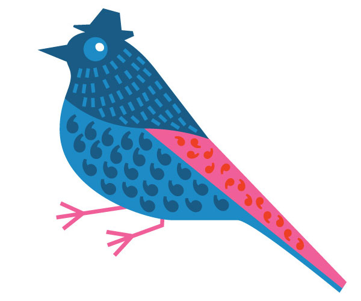
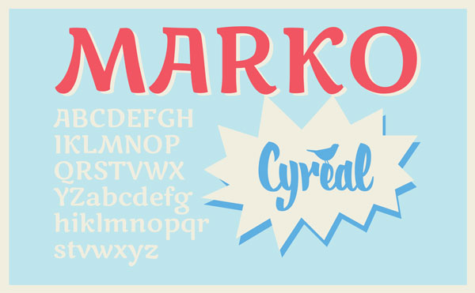
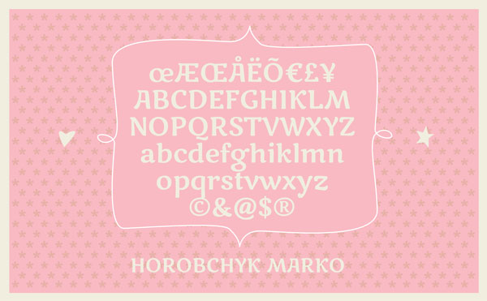
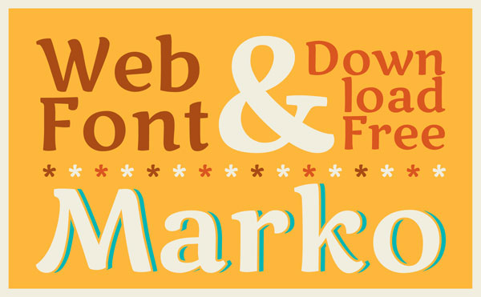
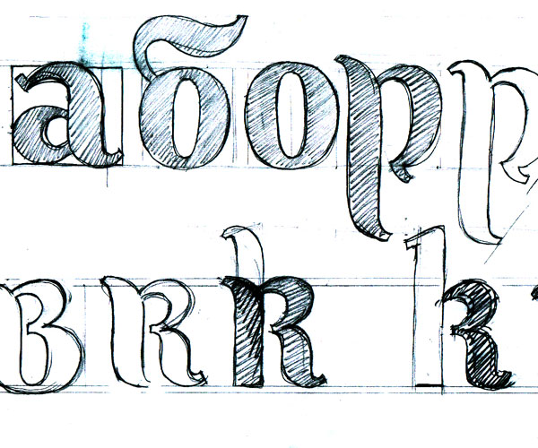

# Marko One Font Project

Marko One is a typeface designed for children's literature. 
The initial idea was to create a typeface-companion for 
[Marko the Sparrow](http://cyreal.org/archives/696 "External Link"), 
a cartoon character by illustrator and calligrapher Eugene Spizhovy.

Marko One is simple and smooth, has special inner tension 
and eye-catchy detailing. The letterforms are based on 
calligraphy and sketches - this is what makes Marko lively, 
enchanting, and amiable. Marko One typeface will work best 
in medium to large sizes and captivating headlines. 
It is technically optimized for better performance on screen,
while carefully adjusted outlines promise good quality in print too.

Marko One is a Unicode typeface family that supports 
languages that use the Latin script and its variants, and 
could be expanded to support other scripts.

